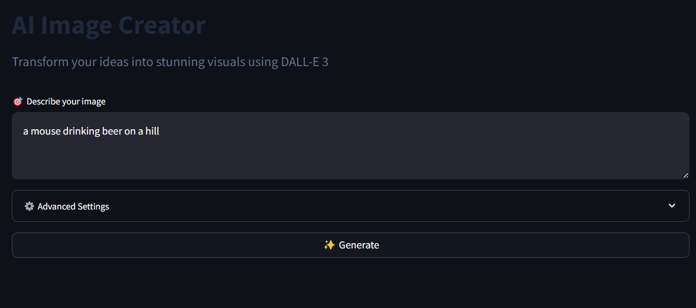

# AI Image Creator

 


A Streamlit web application for generating AI-powered images using DALL-E 3.

## Features

- Generate high-quality images from text descriptions
- Choose between vivid (dramatic) or natural (realistic) styles
- Select image quality (Standard or HD)
- Choose image size (1024x1024, 1024x1792, or 1792x1024)
- Generate up to 4 variations of an image
- Download generated images
- View generation history
- Rate limiting to prevent API abuse

## Setup

1. Clone the repository:
   ```bash
   git clone https://github.com/dimipash/AI_Image_Creator.git
   cd AI_Image_Creator
   ```

2. Create a virtual environment:
   ```bash
   python -m venv venv
   source venv/bin/activate  # On Windows: venv\Scripts\activate
   ```

3. Install dependencies:
   ```bash
   pip install -r requirements.txt
   ```

4. Create a `.env` file and add your OpenAI API key:
   ```
   OPENAI_API_KEY=your_api_key_here
   ```

5. Run the application:
   ```bash
   streamlit run app.py
   ```

## Configuration

The application can be customized through the following options:

- **Art Style**: Choose between 'vivid' (more dramatic) or 'natural' (more realistic)
- **Quality**: Standard or HD
- **Size**: 1024x1024, 1024x1792, or 1792x1024
- **Number of Images**: Generate 1-4 variations

## UI Features

- Modern dark theme download button with vivid text color
- Responsive design for mobile and desktop
- Loading animations
- Tips for better results
- Generation history display

## Requirements

- Python 3.8+
- OpenAI API key
- Streamlit
- python-dotenv
- pydantic

## License

MIT License
