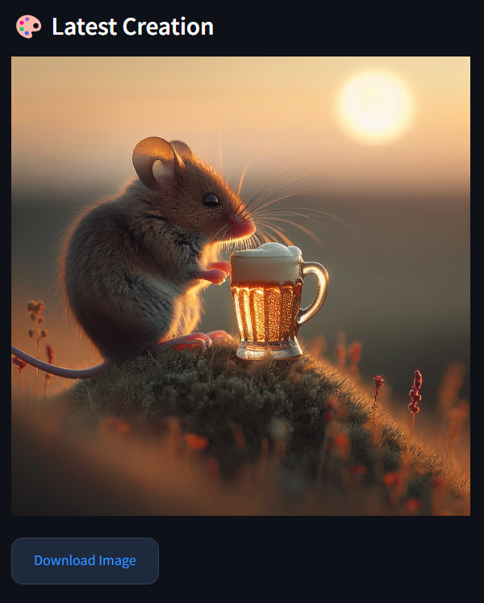

# AI Image Creator

 
 

## Table of Contents
- [Description](#description)
- [Features](#features)
- [Installation](#installation)
- [Usage](#usage)
- [Configuration](#configuration)
- [Tips](#tips)
- [License](#license)

## Description

AI Image Creator is a web application that allows users to generate stunning images based on textual descriptions using OpenAI’s DALL-E 3 model. Whether you need unique artwork, visual content ideas, or just some creative fun, this tool provides an easy and delightful way to create visual art.

## Features

- **Text-to-Image Generation**: Describe your image and generate multiple variations.
- **Interactive Interface**: User-friendly interface built with Streamlit.
- **Carousel Display**: View generated images in an interactive carousel.
- **Full-Sized Image View**: Click to view and download full-sized images.
- **Customizable Styles**: Add custom CSS for personalized styling.

## Installation

### Prerequisites

Ensure you have the following installed:
- Python 3.12.7
- pip (Python package installer)
- An OpenAI API key

### Steps

1. **Clone the repository**
    ```sh
    git clone <repository-url>
    cd <repository-folder>
    ```

2. **Install required packages**
    ```sh
    pip install -r requirements.txt
    ```

3. **Set up environment variables**
    Create a `.env` file in the root directory and add your OpenAI API key:
    ```env
    OPENAI_API_KEY=your_openai_api_key_here
    ```

## Usage

1. **Run the application**
    ```sh
    streamlit run app.py
    ```

2. **Open the web browser**
    Navigate to `http://localhost:8501` in your web browser to access the app.

3. **Generate Images**
    - Enter a detailed description of the image you want to create.
    - Select the number of images to generate.
    - Click the "Generate" button to create your images.

## Configuration

### Streamlit Configurations

- **Page Title**: Set in `PAGE_TITLE`.
- **Page Icon**: Set in `PAGE_ICON`.
- **Layout**: Set in `LAYOUT`.
- **Sidebar State**: Set in `SIDEBAR_STATE`.

### Custom CSS

Place your custom CSS in `static/style.css` to style the app layout and components.

## Tips

1. Be specific and detailed in your descriptions.
2. Include art style preferences.
3. Mention colors and lighting.
4. Describe the composition and contextual elements.

These tips help in generating more accurate and visually appealing images.

## License

This project is licensed under the MIT License. See the LICENSE file for details.

---

*Made with 💜 using DALL-E 3 | © 2024*